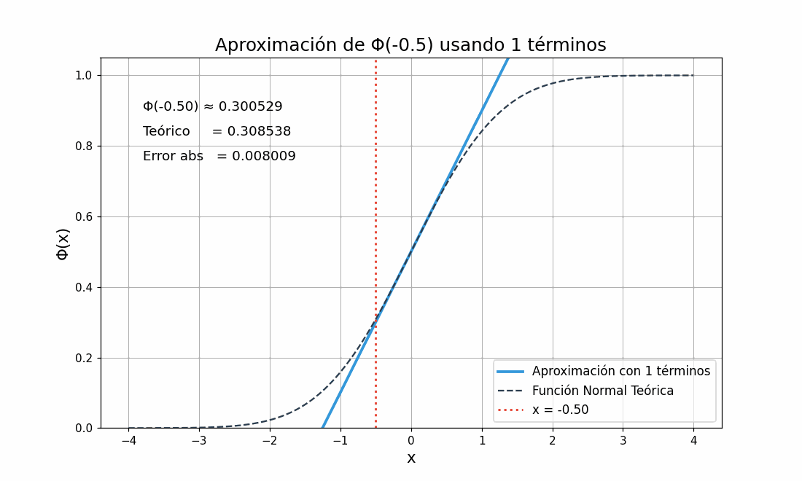

# Proyecto Final — Probabilidad 📊

Este proyecto explora formas de aproximar el calculo de distribución normal estándar $\phi(x)$ Los metodos con los que estarmos trabajando para este calculo es usando la expansion de taylor centrada en 0 y el metodo Montecarlo

## Calculo por expansion de taylor

### Distribución Normal Estándar

La función de distribución acumulada para la variable aleatoria $\( X \sim \mathcal{N}(0,1) \)$ se define como:

  

Ahora si $x\geq 0$

  

Tambien sabemos que la funcion $e^{-\frac{x^2}{2}}$ se puede expresar de la siguiente manera:

  

Sustituyendo los $e^{-\frac{t^2}{2}}$ tenemos el siguiente desarrollo y tomando solamente la parte donde $x\geq 0$

  

  

Con este desarrollo tenemos una integral que es mas facil de resolver que la expresion original. por lo que tenemos la siente expresion 

  

Ahora esta formula solo funciona si si $x\geq 0$, la solucion si $x < 0$ 

  

### Implementacion 
Se creo una implementacion en python y C donde se aplica la formula desarroya y esta funcion va a calcualar el valor de $\phi(x)$ Aqui se muestra graficamente como funciona la aproximacion de la funcion:

